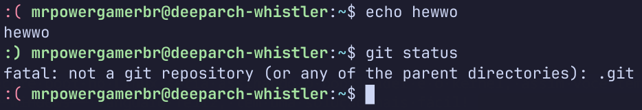
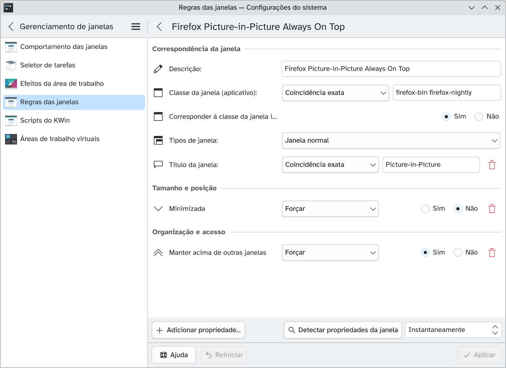
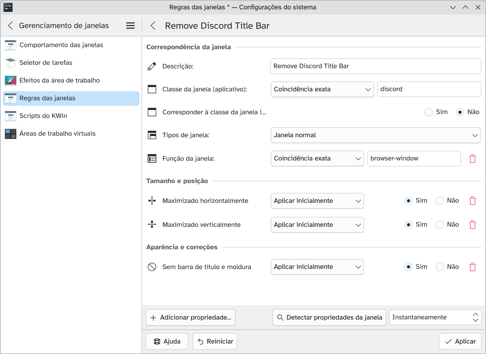

<h1 align="center">🐧 PowerArchLinux 🐧</h1>

Um guia de como instalar o Arch Linux da maneira que eu (MrPowerGamerBR) gosto, feito exclusivamente para o MrPowerGamerBR usar quando instalar o Arch Linux.

Eu não considero uma instalação do Arch Linux a "definitiva". Toda hora eu penso "eu vou tentar fazer coisas novas no meu sistema e não me importo se ele quebrar" para assim eu acabar aprendendo novas coisas com o que você fez, para depois reinstalar (agora com as novas coisas que você aprendeu) e pensar "desta vez é para valer!" para, no final, reinstalar tudo de novo depois. A realidade é que a instalação "definitiva" irá chegar com o tempo.

Eu deixo o meu guia público para outras pessoas verem e aprenderem coisas novas. Eu sempre gosto de procurar "what are your must have packages Arch Linux" no Google para ver o que as outras pessoas recomendam, e nada mais justo que postar o que *eu recomendo* para outras pessoas verem.

Você NÃO deve seguir este guia a risca se o seu nome não for "MrPowerGamerBR", já que ele foi moldado para o meu sistema e ele tem várias coisas que você não vai querer e nem vão funcionar no seu sistema. Se você quer instalar Arch Linux, você deve [instalar ele seguindo o guia](https://wiki.archlinux.org/title/Installation_guide). Entretanto, talvez o guia tenha algumas coisas novas que você não sabia. :3

## Por que usar Linux ao invés do Windows?

Eu uso Linux em servidores a 10+ anos, mas em desktops eu sempre gostei do Windows. Eu já usei Linux no desktop no passado (Xubuntu), mas apenas quando o meu sistema era *tão ruim* ao ponto de ser inviável de usar Windows... Para mim, Windows sempre foi "just works™". 

Mas o primeiro "rude awakening" foi quando a Microsoft começou a achar que era uma boa ideia começar a enfiar propagandas no Windows. Não, eu não quero OneDrive. Não, eu não quero usar o Copilot. Não, eu não quero conectar uma conta da Microsoft. Não, eu não quero comprar o pacote Office. Não, eu não quero instalar o TikTok. Eu só quero mexer no meu computador!

É possível filtrar essas propagandas do Windows se você mexer no registro do Windows e instalar o Windows na região "US (World)", mas na minha opinião essas coisas *não* deveriam existir no sistema operacional para começo de conversa.

Claro, tem o argumento que se você não paga pelo Windows você não deveria reclamar que ele tem essas propagandas forçadas. Mas o motivo de eu não pagar pelo Windows é *justamente* porque eu sei que, mesmo se eu pagar, o Windows irá continuar do mesmo jeito! E eu sei disso pois eu tenho um laptop que veio com o Windows 11 (ou seja, é uma licença oficial) e ele tem essas mesmas propagandas.

As propagandas são apenas os ossos do ofício, você engole elas pois não tem alternativas... Mas quando o Windows começou a ter problemas que [afetam funções simples do sistema, como trocar pastas](https://x.com/MrPowerGamerBR/status/1947693425060417972), foi o momento que eu fiquei frustrado o suficiente para querer migrar para Linux.

Mas infelizmente a realidade é que **largar o Windows 100% ainda é inviável**, mas você não precisa largar o Windows 100%, você pode fazer dual boot para os jogos que só rodam no Windows (VALORANT) ou usar outro computador/laptop e acessar ele remotamente para usar os apps que só rodam no Windows.

* [How I Broke up with Adobe](https://youtu.be/lm51xZHZI6g) (este foi o vídeo que colocou a semente na minha cabeça de "e se eu realmente usar Linux no desktop")
* [I installed Linux (so should you)](https://youtu.be/pVI_smLgTY0)
* [the windows taskbar is a UX nightmare...](https://youtu.be/wA_jroxKpao)

E eu não sei se é apenas placebo, mas para mim Linux roda MUITO mais "snappy" do que o Windows.

## Por que usar Arch Linux ao invés de *insira distro aqui*?

Uma vantagem para mim é que o Arch Linux é bleeding edge, ou seja, ele é uma das distros mais atualizadas que você pode ter. Isso é vantajoso para hardwares que também são bleeding edge, como, por exemplo, placas de vídeo da Nvidia.

Claro, um dos problemas do Arch é que as vezes é *chato* você ter que descobrir como fazer a coisa xyzabc funcionar, e ter que ficar lendo qual package usar e ter paralisia de escolha tentando entender quais são as vantagens e desvantagens de cada uma. Mas ao mesmo tempo isso é uma vantagem, pois você sabe as vantagens e desvantagens de tudo que você está instalando!

Arch é meio chato de instalar, já que você tem que usar o terminal para instalar o sistema operacional, mas depois de instalado ele funciona igual a qualquer outra distro. Como eu já uso Linux em servidores e pelo WSL há anos, eu não tenho uma aversão ao terminal. Na realidade, eu amo o terminal e amo ele *noms the terminal*. (mas ao mesmo tempo eu gosto de uma GUI, pois uma GUI ajuda a descobrir coisas que você *não* conhece)

Outra *grande* vantagem do Arch Linux é o AUR (Arch User Repository), onde lá tem várias packages feitas por usuário que você pode instalar. Se algo não existe nos repositórios oficiais, ela provavelmente vai existir no AUR.

Sinceramente, no final Linux é tudo igual, o que muda é apenas o sistema de packaging. Você não é menos "usuário de Linux" só porque você usa Linux Mint ou Ubuntu, e você não é mais "usuário de Linux" só porque você fez a sua própria distro pelo Linux from Scratch. Essa é a beleza do Linux, você pode usar as coisas do jeito que *você* quiser.

E vamos ser sinceros, se o PewDiePie usa Arch Linux, você também consegue.

## Por que usar KDE Plasma ao invés de *insira DE aqui*?

Eu gosto do KDE Plasma pois ele é o Desktop Environment mais parecido com o jeito que o Windows funciona. Eu uso o Windows desde o [Windows 98 SE](https://youtu.be/QQFjrS_Oxq4) e eu sempre gostei do jeito que o Windows funciona. O problema do Windows não é o desktop environment, o problema é o jeito que o Windows 11 está decaíndo sem ter uma luz no fim do túnel.

Enquanto muitas pessoas (ThePrimeagen, DHH, etc) espalham a palavra dos tiling managers (Hyprland) e como eles são muito úteis para otimizar o seu trabalho, mas na minha experiência eu acabo preferindo muito mais um stacking window manager do que o tiling window manager. Mas isso varia de pessoa para pessoa! Novamente, essa é uma das belezas do Linux, você pode usar o seu desktop da maneira que *você* quiser.

Para mim, a parte legal de tiling managers é a parte de "fast switch" de aplicativos, de você ter vários "desktops" e poder ficar alternando entre eles rapidamente. Se você é como eu e é isso que te intriga em tiling managers, você pode fazer a mesma coisa no KDE Plasma usando o [kdotool](https://github.com/jinliu/kdotool) ou até mesmo um [script do KWin](https://www.reddit.com/r/kde/comments/1jr0dn4/maximizing_a_window_via_kwin_script/mpw5src/) para automaticamente maximizar e colocar em foco o app que você deseja ao usar um atalho.

Outra vantagem do KDE Plasma é que ele é *muito* customizável. Ele tem muitas opções de personalização para deixar o seu desktop da maneira que você quiser.

## Por que você escreveu as suas motivações e as suas escolhas, se o guia é para você mesmo?

Não sei.


## Instalação do Arch Linux

O nome do ID do GRUB é "ArchLinuxGRUBInsecure" para indicar que é sem suporte secure boot. Eu uso a tela de seleção de OS da minha placa mãe, então eu não preciso iniciar o Windows pelo GRUB.

Para ficar mais fácil, a instalação é separada em fases, pois ninguém gosta de ficar vendo o terminal do Arch Linux esperando instalar tudo.

A primeira parte é o "essencial" e depois de instalado, instala o resto.

```bash
loadkeys br-abnt2
mkfs.ext4 /dev/nvme0n1p4
mount /dev/nvme0n1p4 /mnt
mount --mkdir /dev/nvme0n1p1 /mnt/efi
reflector --country Brazil --protocol http,https --sort rate --fastest 2 --save /etc/pacman.d/mirrorlist
pacstrap -K /mnt base base-devel linux linux-firmware pacman-contrib amd-ucode nano networkmanager git nvidia-open grub efibootmgr vi vim sudo curl wget zip unzip less rsync firefox plasma-meta kde-system sddm konsole ark kwalletmanager noto-fonts noto-fonts-extra noto-fonts-cjk noto-fonts-emoji ttf-jetbrains-mono
genfstab -U /mnt >> /mnt/etc/fstab
arch-chroot /mnt
ln -sf /usr/share/zoneinfo/America/Sao_Paulo /etc/localtime
hwclock --systohc
nano /etc/locale.gen
locale-gen
nano /etc/locale.conf # LANG=pt_BR.UTF-8
nano /etc/vconsole.conf # KEYMAP=br-abnt2
nano /etc/hostname # hostname da maquina
passwd # troca a senha do usuario root
useradd -m -G wheel -s /bin/bash mrpowergamerbr
visudo # descomentar %wheel ... perto do final (coloca para poder usar sudo sem precisar de senha)
passwd mrpowergamerbr # troca a senha do usuario MrPowerGamerBR
pacman -Syu
systemctl enable NetworkManager.service
systemctl enable sddm.service
systemctl enable fstrim.timer
fallocate -l 32G /swapfile # adicionar swap file (é bom ter para evitar programas morrendo ao usar mais memória do que você tem)
chmod 600 /swapfile
mkswap /swapfile
swapon /swapfile
echo '/swapfile none swap defaults 0 0' | sudo tee -a /etc/fstab
swapon --show # verificar se o swap está funcionando
grub-install --target=x86_64-efi --efi-directory=/efi --bootloader-id=ArchLinuxGRUBInsecure
nano /etc/default/grub # 1280x720 no DISPLAY e tirar quiet
grub-mkconfig -o /boot/grub/grub.cfg
sudo cat /boot/grub/grub.cfg | grep ucode # ver se está com o ucode ativado
exit

# desconectar o monitor secundário (para o KDE reconhecer por padrão o monitor principal sem precisar mexer nos painéis manualmente)
reboot
```

**Explicação das Packages:**
* `reflector`: Para poder atualizar mirrors do Arch
* `cups cups-pdf system-config-printer`: Suporte para impressora
* `krita`: App de desenho/edição de imagem
* `inkscape`: App de ilustração SVG
* `kdialog`: Permite enviar notificações do KDE Plasma pelo terminal
* `kimageformats`: Adiciona thumbnails no Dolphin para AVIF, JPEG XL, etc
* `dolphin-plugins`: Adiciona plugins no Dolphin, como montar ISOs
* `ffmpegthumbs`: Adiciona thumbnails no Dolphin para vídeos
* `kdeconnect`: KDE Connect, para conectar o celular para poder compartilhar o clipboard e etc
* `kdegraphics-thumbnailers`: Adiciona thumbnails no Dolphin para PDFs, etc
* `kio-admin`: Para gerenciar arquivos como administrador (permite clicar com botão direito em uma pasta -> Abrir como administrador)
* `gwenview`: Visualizador de imagens do KDE
* `phonon-vlc`: Usado por alguns apps para reprodução de multimídia
* `xwaylandvideobridge`: Permite apps XWayland compartilharem janelas do Wayland
* `xdg-desktop-portal-gtk`: Sincroniza fontes do Flatpak com a fonte do Plasma
* `systemd-coredumpd`: Crash handler global para o DRKonqi
* `tuned`: Sistema de energia
* `kcalc`: Calculadora do KDE
* `plasma-systemmonitor`: "Gerenciador de Tarefas" do KDE
* `vlc vlc-plugins-all`: VLC + "Plugins" (Codecs) para o VLC
* `flatpak-kcm`: Permite configurar as permissões de apps Flatpak
* `dosfstools`: Usado para poder editar partições FAT16 no KDE Partition Manager
* `pkgstats`: Envia estatísticas dos pacotes instalados para o Arch Linux
* `yt-dlp`: Ferramenta para baixar vídeos do YouTube pelo terminal
* `wl-clipboard`: Ferramenta para interagir com o clipboard pelo terminal (Wayland)
* `sshfs`: Ferramenta para montar um servidor SSH como se fosse uma pasta local, também é necessário pelo KDE Connect para montar celulares conectados
* `pacman-contrib`: Scripts e ferramentas para o pacman, usado para o `paccache.timer`, que automaticamente limpa o cache do pacman 
* `bash-completion`: Vários arquivos para auto complete para o bash
* `tldr`: Mostra um resumo de como usar um comando ao usar `tldr`
* `man-pages man-db`: Manual pelo `man`

**Notas:**
* `kio-gdrive`: Permite conectar o Google Drive e outros serviços no Dolphin, entretanto não está funcionando devido a problemas no OAuth2 do KDE (https://discuss.kde.org/t/kde-online-accounts-not-signing-in/3411/38)
* `qt6-imageformats`: Fala que é necessário para ver imagens Webp no Dolphin e no Gwenview, mas na minha experiência ele funciona sem precisar disso.
* `filelight`: Não funciona bem em GPUs da Nvidia
* `kcolorchooser`: Color picker, funciona mas seria legal uma alternativa que permite você dar pick sem precisar clicar no botão primeiro

### Após Reiniciar

* Colocar para dar migalhas de estatísticas/tracking para o KDE Plasma para ajudarem eles com o desenvolvimento <3
* Monitor -> Escala 150%
* Teclado -> Layout # nome do layout: Português (Brasil)
* Desativar suspender na seção de energia das configurações (pois crasha o KWin - talvez isso arrumaria? https://www.reddit.com/r/kde/comments/1i4w7q9/kde_plasma_crashes_after_wake_from_sleep_state/)
* Bloqueio de Tela -> Nunca
* Trocar cursor do KDE para o Breeze Light, tamanho do cursor do KDE para 30 ao invés de 24
* Dolphin -> Mostrar arquivos ocultos
* Dolphin -> Configurar Dolphin -> Interface -> Manter uma janela única do Dolphin
* Dolphin -> Configurar Dolphin -> Mostrar ao Iniciar -> `/home/mrpowergamerbr`
* Dolphin -> Configurar Dolphin -> Interface -> Mostrar o caminho completo na barra de título
* Dolphin -> Configurar Dolphin -> Interface -> Barras de Localização e Status -> Mostrar o caminho completo na barra de localização
* Animações -> Velocidade praticamente insantânea, desativar animações
* Bordas da Tela -> Desativar peek (top esquerdo) e desativar barreira de borda
* KRunner -> Colocar para centralizar, colocar para que pesquisa de janelas tenha prioridade
* Painel -> Desativar que possa silenciar aplicações clicando no ícone
* Painel -> Rolar em uma tarefa -> Não faz nada
* Painel -> Clicar em tarefas agrupadas -> Exibir lista textual
* Painel -> Desativar "Exibir visualizações em janelas pequenas quando passar o mouse sobre as tarefas"
* Mouse -> velocidade -0.96, velocidade de rolagem um pouco acima do normal
* Sessão da Área de Trabalho -> Iniciar com uma sessão vazia
* Tela de Autenticação -> Comportamento -> Configurar login automático
* Atalhos -> Spectacle -> Iniciar -> CTRL + Print Screen
* Atalhos -> Spectacle -> Capturar o Monitor Atual -> Print Screen 
* Spectacle -> Desativar "Incluir sombras da janela"
* Spectacle -> Configurar Spectacle... -> "Salvar arquivo para a pasta padrão"
* Ativar o KWin de minimizar tudo no "Scripts do KWin", configurar para Win + D no app de "Atalhos"
    * Para mim isso é mais natural que a tecla padrão de "espiar desktop", pois o "espiar desktop" não faz as janelas maximizarem novamente ao clicar em qualquer uma delas
* Cores -> Cor de destaque personalizada -> #29a6fe

No KWalletManager, criar uma wallet (ou trocar a senha da wallet que já existe) com uma senha vazia, para não ficar pedindo o login do user quando abrir o Discord

```bash
nano /etc/pacman.conf # ativar multilib (para Steam) e ativar Color
nano /etc/xdg/reflector/reflector.conf # Configurar o Reflector igual a chamada anterior, com country e protocol e rate do Brazil

pacman -Syu reflector fastfetch flatpak kimageformats kio-admin dolphin-plugins ffmpegthumbs kdegraphics-thumbnailers phonon-vlc xwaylandvideobridge xdg-desktop-portal-gtk systemd-coredumpd kcalc ksshaskpass kdialog plasma-systemmonitor vlc flatpak-kcm dosfstools htop obs-studio ffmpeg openssh tailscale docker docker-compose unrar qbittorrent ntfs-3g wine-staging winetricks cups cups-pdf system-config-printer krita inkscape kdeconnect gwenview pkgstats yt-dlp wl-clipboard sshfs vlc-plugins-all bash-completion tldr man-pages man-db

systemctl enable --now cups.service
systemctl enable --now tailscaled.service
systemctl enable --now docker.service
systemctl enable pkgstats.timer
systemctl enable paccache.timer # Limpa o cache do pacman periodicamente
systemctl enable pacman-filesdb-refresh.timer # https://wiki.archlinux.org/title/Pacman#Querying_package_databases
systemctl enable reflector.timer

nano /usr/lib/systemd/user.conf.d/00-process-timeouts.conf # para diminuir o timeout padrão (120s) do systemd, é bom para quando tem um app "locked up" na hora de desligar

[Manager]
DefaultTimeoutStopSec=5s
```

Instalar Firefox Nightly em `/opt/firefox-nightly`

`nano /home/mrpowergamerbr/.local/share/applications/firefox-nightly.desktop`

```
[Desktop Entry]
Version=1.0
Name=Firefox Nightly
GenericName=Web Browser
Comment=Browse the World Wide Web with the latest features
Exec=/opt/firefox-nightly/firefox %u
Icon=/opt/firefox-nightly/browser/chrome/icons/default/default128.png
Terminal=false
Type=Application
MimeType=text/html;text/xml;application/xhtml+xml;x-scheme-handler/http;x-scheme-handler/https;
Categories=Network;WebBrowser;
StartupWMClass=firefox-nightly
```

Configurar Firefox Nightly para ser o browser padrão nas configs do KDE (a opção de browser padrão que o Nightly oferece não funciona)

No Firefox `about:config`, ative para usar o XDG Desktop Portals (para usar o file picker do QT que é bem melhor que o do GTK):

* widget.use-xdg-desktop-portal.file-picker – Whether to use XDG portal for the file picker
* widget.use-xdg-desktop-portal.mime-handler – Whether to use XDG portal for the mime handler
* widget.use-xdg-desktop-portal.settings – Whether to try to use XDG portal for settings/look-and-feel information
* widget.use-xdg-desktop-portal.location – Whether to use XDG portal for geolocation
* widget.use-xdg-desktop-portal.open-uri – Whether to use XDG portal for opening to a file

Trocar tudo para `1` ao invés de `2` (mais informações: https://wiki.archlinux.org/title/Firefox#XDG_Desktop_Portal_integration)

Nas configurações do Firefox, ativar a "Rolagem Automática" (ativa o sistema de rolar com o botão do meio do mouse, igual como é no Windows)

Deixar o terminal bonitin (Power Style)

`nano ~/.bashrc`

(Não se esqueça de remover/comentar o PS1 que já vem por padrão!!)

```bash
source /etc/environment
bind 'set show-all-if-ambiguous on'
bind 'TAB:menu-complete'
source /usr/share/bash-completion/completions/git # autocomplete do git similar ao Git Bash do Windows
[[ $PS1 && -f /usr/share/bash-completion/bash_completion ]] && \
    . /usr/share/bash-completion/bash_completion

parse_git_branch() {
    local branch
    branch=$(git symbolic-ref --short HEAD 2>/dev/null)
    if [[ -n "$branch" ]]; then
        # Wrap escape codes and add a color reset at the end.
        echo -e " \[\e[0;33m\]($branch)\[\e[0m\]"
    fi
}

PROMPT_COMMAND=__prompt_command    # Function to generate PS1 after CMDs

__prompt_command() {
    local EXIT="$?"                # This needs to be first
    PS1=""

    if [[ $EXIT -eq 0 ]]; then
        PS1+="\[\e[1;32m\]:) "
    else
        PS1+="\[\e[0;31m\]:( "
    fi

    # Wrap all escape codes and removed a redundant one.
    PS1+="\[\e[1;32m\]\u@\h\[\e[0;37m\]:\[\e[0;36m\]\w"

    PS1+=$(parse_git_branch)

    # Wrap escape codes and add a final color reset.
    PS1+="\[\e[0;37m\]\$ \[\e[0m\]"
}
```



Ativar syntax highlighting no nano

`echo "include /usr/share/nano/*.nanorc" >> ~/.nanorc`

```bash
pacman -Syu steam

cd $HOME && sudo pacman -S --needed git base-devel && git clone https://aur.archlinux.org/yay.git && cd yay && makepkg -si # instalar yay
yay -Syu discord-canary visual-studio-code-bin epson-inkjet-printer-202101w kdotool

sudo tailscale up # para conectar na rede do tailscale
```

**Explicação das Packages:**
* `epson-inkjet-printer-202101w`: Driver da Impressora EPSON L3210
* `kdotool`: Ferramenta para poder interagir com janelas do KWin pelo terminal, similar ao `xdotool`.

Instalar a fonte <https://github.com/jacobxperez/lexica-ultralegible> e ativar ela no sistema, pois [Fontes OTF renderizam de forma mais "crispy"/melhor em apps Qt](https://www.reddit.com/r/linux/comments/1b1jasr/exploring_font_rendering_a_comparative_journey/ksfoq86/).

```
sudo mkdir -p /usr/local/share/fonts/l/
sudo wget -O /usr/local/share/fonts/l/LexicaUltralegible-Regular.otf https://raw.githubusercontent.com/jacobxperez/lexica-ultralegible/refs/heads/main/fonts/otf/LexicaUltralegible-Regular.otf
sudo wget -O /usr/local/share/fonts/l/LexicaUltralegible-Bold.otf https://raw.githubusercontent.com/jacobxperez/lexica-ultralegible/refs/heads/main/fonts/otf/LexicaUltralegible-Bold.otf 
sudo wget -O /usr/local/share/fonts/l/LexicaUltralegible-BoldItalic.otf https://raw.githubusercontent.com/jacobxperez/lexica-ultralegible/refs/heads/main/fonts/otf/LexicaUltralegible-BoldItalic.otf 
sudo wget -O /usr/local/share/fonts/l/LexicaUltralegible-Italic.otf https://raw.githubusercontent.com/jacobxperez/lexica-ultralegible/refs/heads/main/fonts/otf/LexicaUltralegible-Italic.otf
sudo fc-cache -f -v
```

Alterar fontes do sistema para Lexica Ultralegible e JetBrains Mono

Konsole:
* Desativar "Memorizar tamanho da janela"
* Ativar "Usar a mesma instância do Konsole para todos"

catpputin mocha tema para o konsole (pasta de temas: `~/.local/share/konsole`)
```
wget -O ~/.local/share/konsole/catppuccin-mocha.colorscheme https://raw.githubusercontent.com/catppuccin/konsole/refs/heads/main/themes/catppuccin-mocha.colorscheme
```

* Auto inicializar -> Steam, Discord Canary
* painel = flutuante (somente miniaplicativos, observação: talvez tenha que usar o Force Floating no panel colorizer)

reiniciar

* definir wallpaper (bliss)
* definir nome da conta (MrPowerGamerBR)
* definir ícone de conta (katy_snap)

Se uma partição NTFS não montar falando que o "arquivo não existe", é bom usar `sudo ntfsfix /dev/sdb2` (sendo `dev/sdb2` a partição)
Para o git guardar as credencials, use `git config --global core.askPass /usr/bin/ksshaskpass`, assim as credenciais serão guardadas na wallet do KDE

Para a senha, crie um Personal access token no GitHub

Para configurar a impressora, é melhor usar a ferramenta de configuração do KDE Plasma (Impressoras)

Atalhos que o Wine cria ficam no `/home/mrpowergamerbr/.local/share/applications/`

Instalar o [PowerBreeze](https://github.com/MrPowerGamerBR/PowerBreeze/):

```
cd $HOME/.local/share/plasma/desktoptheme/ && git clone https://github.com/MrPowerGamerBR/PowerBreeze/
```

E depois altere para o PowerBreeze no tema do Plasma.

```bash
git config --global user.email "git@mrpowergamerbr.com"
git config --global user.name "MrPowerGamerBR"
```

## Regras das Janelas

Eu gosto do jeito que o Picture-in-Picture do Firefox funciona no Windows, onde o Picture-in-Picture sempre fica no topo de qualquer janela e sempre fica presente na tela mesmo ao usar `Windows + D`.

Infelizmente o Firefox não tem esse mesmo behavior no KDE Plasma, mas felizmente é possível corrigir isso usando as "Regras das Janelas" do KDE! E o melhor de tudo é que, diferente do Windows, você pode configurar esse behavior para qualquer janela que você quiser.



Outra regra de janela que eu gosto de configurar é fazer que remova a title bar do Discord, assim ficando mais natural já que o Discord meio que tem a própria title bar.



Claro, se você remover a title bar você não conseguirá mover o Discord já que a title bar do Discord não é "movível". Eu não preciso ficar movendo a janela do Discord, mas se por ventura você precisar, você pode temporariamente reativar ela clicando com botão direito no Discord na Taskbar -> Mais -> Desativar "Sem barra de título e moldura"

## Badge de Notificações Unread no Discord Canary

O problema é que o Discord hardcodeou o `discord.desktop` no código-fonte dele, então ele espera que o nome do app seja `discord.desktop` para as notificações funcionarem.

```bash
pacman -Syu libunity
cp /usr/share/applications/discord-canary.desktop ~/.local/share/applications/discord.desktop && update-desktop-database ~/.local/share/applications/
```

E depois é necessário iniciar o Discord Canary pela sua versão. Um problema deste workaround é que toda hora que você atualizar o Discord Canary você tem que usar `update-desktop-database ~/.local/share/applications/`.

## Electron Wayland

`~/.config/electron-flags.conf`

```
--enable-features=WaylandWindowDecorations
--ozone-platform-hint=auto
```

Nem todos os apps usam estas flags, entretanto elas são úteis para os apps Electron que respeitam essas flags.

Isso também arruma uma coisa chata no Visual Studio Code onde ele fica rolando o conteúdo do arquivo aberto se o cursor está perto do topo/fundo da tela.

## IntelliJ IDEA Wayland

Para o IntelliJ IDEA, adicione o `-Dawt.toolkit.name=WLToolkit` nas configurações da VM do IDEA

## Compilação de Coisas

Se você quiser compilar coisas que não sejam Java/Kotlin/etc, instale o `cmake extra-cmake-modules`

## Secure Boot

Eu não sei vocês, mas eu não ligo para as vantagens do secure boot. Nenhum software precisa dessa bomba no Linux e, sinceramente, se um vírus conseguiu instalar um rootkit na partição EFI, significa que eu tenho problemas maiores para resolver.

Para mim, eu só quero suporte ao Secure Boot para eu poder fazer dual boot com o Windows, para poder rodar o [Vanguard](https://img.ifunny.co/images/35de2f8761bcb06de982e5669af60c35cb63e241f775c400f4b03a5ffac6c10d_1.jpg) nele sem precisar ficar fazendo um malabarismo de

* Vai na BIOS
* Altera o Secure Boot para "Windows UEFI Mode"
* Reinicia
* Vai na BIOS de novo
* Escolhe o Windows

O jeito certo de fazer o secure boot no Linux seria assinando o bootloader e o kernel, assim você tem a segurança que o Secure Boot te proporciona. Mas se você quer o Secure Boot apenas para deixar o ~~Windows~~ Vanguard feliz, tem uma solução mais fácil!


É possível você configurar o `shim-signed` para pular a validação de assinatura.

```bash
sudo pacman -Syu mokutil
yay -Syu shim-signed
```

Primeiro instale o grub normalmente, é necessário instalar com os modules desta forma para ter suporte ao SBAT (Secure Boot Advanced Targeting), que o shim precisa para bootar.

```bash
sudo grub-install --target=x86_64-efi --efi-directory=/efi --bootloader-id=ArchLinuxGRUB --modules="tpm" --sbat /usr/share/grub/sbat.csv --no-nvram
```

(O `--no-nvram` instala o GRUB sem criar uma entrada no EFI)

Copie o shim signed para o grub do Arch Linux
```bash
sudo cp /usr/share/shim-signed/shimx64.efi /efi/EFI/ArchLinuxGRUB/bootx64.efi
sudo cp /usr/share/shim-signed/mmx64.efi /efi/EFI/ArchLinuxGRUB/
```

Desative a validação do SecureBoot
```bash
sudo mokutil --disable-validation
```

A senha pode ser qualquer coisa, mas é melhor colocar só vários `a` pois o MOK Manager vai pedir a senha, e ele pede caracteres aleatórios da senha ao invés de pedir a senha por completo.

E, finalmente, crie um uma entrada no EFI
```bash
sudo efibootmgr --create --disk /dev/nvme0n1 --part 1 --label "ArchLinuxGRUB" --loader '\EFI\ARCHLINUXGRUB\BOOTX64.efi'
```

Isso irá criar uma entrada que irá bootar o `bootx64.efi`, que é o shim da Microsoft.

No primeiro boot, ele irá iniciar o MOK Manager, lá é necessário ir na opção para desativar o secure boot.

Se a opção não aparecer no menu EFI, significa que o arquivo não existe!

Ao iniciar, ele irá aparecer "Booting in insecure mode".

```
:) mrpowergamerbr@deeparch-whistler:~$ mokutil --sb-state
SecureBoot enabled
SecureBoot validation is disabled in shim
```

Para reverter a verificação do `shim-signed`, você pode usar 

```bash
sudo mokutil --enable-validation
```